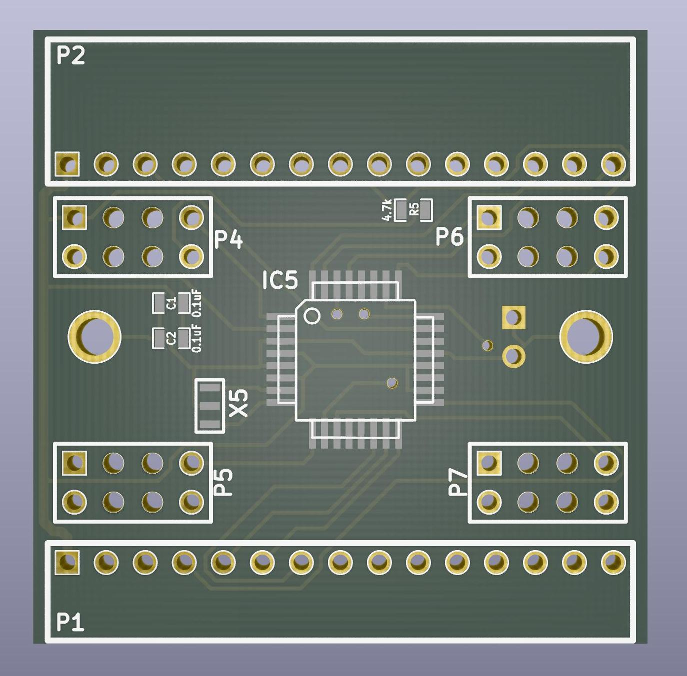

# Communication PCB

The communication PCB or "comm board" measures 40×40mm² and has a 15 pin connector on the bottom and a matching socket on the top edge. This board extracts data packets for the current panel from the SPI stream and sends them via I²C to the driver board. The connectors always need to be connected to either a adjacent comm board or an arena.

{:.ifr}

To identify packets for the current panel, each comm uses four of its connectors as "chip select" lines. This means, while the first chip select line is active, the comm board splits and forwards the received data to the driver board. Independently, the data is always forwarded to the next panel. In addition, the comm board drops the first chip select line from the input and makes the second input chip select line the first output chip select, the 3rd becomes second, and the fourth the 3rd output. This way, up to four stacked panel PCB can be addressed individually.

While the chip select line is active for the current panel, a micro controller unit (MCU) splits the incoming signal into smaller chunks. The driver boards are usually divided into quadrants, and the comm board forwards the matching data packages to the quadrants via I²C bus. The change of protocol has historic reasons. Most recent [comm boards v0.3](#commv0p3) use four connectors for the driver board, earlier versions had only two.

## Panel Comm PCB v0.3
{:#commv0p3 .clear}

{:.ifr}

The communicaiton board is a 40×40mm² PCB with two layers, most recently available as [version v0.3](https://github.com/floesche/panels_g4_hardware/tree/master/atmega328/four_panel/20mm_matrix/ver3/comm/). The connectors are designed as through-hole, other components are SMD.

### Function

The comm board v0.3 receive signals (P1), send them on (P2). Based on the chip select line it identifies the signals relevant for the current panel. This processing is done with the help of a 20MHz ATMEGA328P-AUR (IC5). The relevant signals are passed to one of the four driver board quadrants (P4…P7).

{:.ifr}

### Design

The files are inside the [panels_g4_hardware](https://github.com/floesche/panels_g4_hardware/tree/master/atmega328/four_panel/20mm_matrix/ver3/comm) repository. Find the relevant files inside the `atmega328` tree with the `four panel` layout on a `20mm matrix`. The link above gets you inside this tree, directly to the `comm` board layout. Find the production files inside the `gerber` directory.

The design files are shared under a creative commons license as [KiCAD](https://kicad-pcb.org/) EDA source files. They were initially developed by [IORodeo](https://iorodeo.com). If you open the schematics in a current version of KiCAD you will be asked to remap the symbols when you first open the files.

## Panel Placeholder PCB
{:#placeholder}

{:.ifr}

This PCB acts as a drop-in replacement for panels within a column. It has a cut out of 35×21mm² which you can use to point a camera or other device through that column. In most cases this is not needed, yet it is the most simple and cheap PCB you can get produced from the G4 system. So if you haven't had any experience with the process of ordering PCBs, you might want to start here.

If you want to skip a panel within a column, you will need to connect the chip select lines accordingly. The image on the right shows which input and output connectors your want to connect. Note, that the signal is travelling from the bottom to the top. This has often been done with wires.

Alternatively you can use the placeholder PCB to achieve the same. The PCB has the same outer dimensions and same connectors as the Comm PCB and provides the wiring described above between input and output.
{:.clear}

The design files for this simple 2-layer PCB are in the [panels_g4_hardware](https://github.com/floesche/panels_g4_hardware/tree/master/placeholder) repository inside the `placeholder` directory. The design was done in [KiCAD](https://kicad-pcb.org/). The files ready for production are inside the `placeholder/production_v0` folder. Most recently [placeholder-v0.2](https://github.com/floesche/panels_g4_hardware/blob/master/placeholder/production_v0/placeholder_v0p2.zip) uses length matched traces. All you need to order this design is the zip file, which contains the relevant files from the directory, and most manufacturers will accept. So far we have ordered this exact design from [OSHPark](https://oshpark.com/) with a quick turn-around time of around 5 days and a total cost of $10 per board, including components. With enough lead time, higher quantities, and other manufacturers the price should be around $1 per unit.

The placeholder might be a good start to familiarize yourself with file types, the organization of our repositories, and the whole production process, if you have never done that before. Otherwise please apologize the boring details in the text above.

### Panel Comm PCB
{:#comm .clear}

The G4 panels consist of two PCBs, the "Comm PCB" that ensures communication with the arena and neighboring panels, and the "Driver PCB" with all the LEDs.

The "Comm PCB" is comparably simple. 