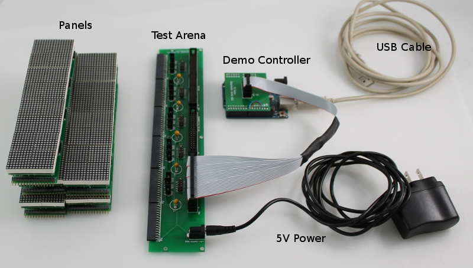
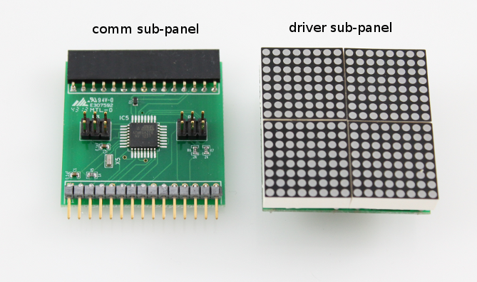
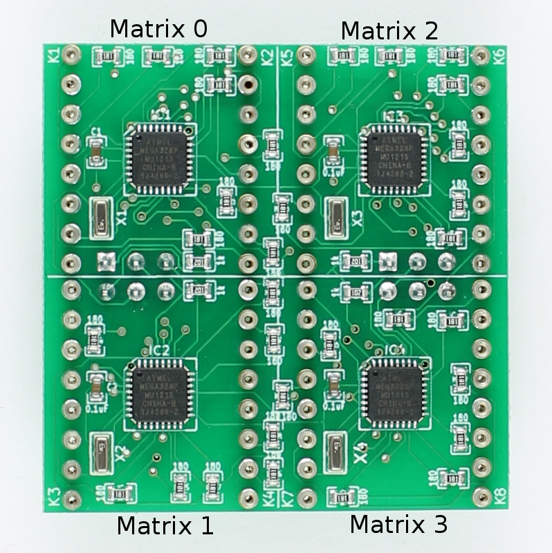
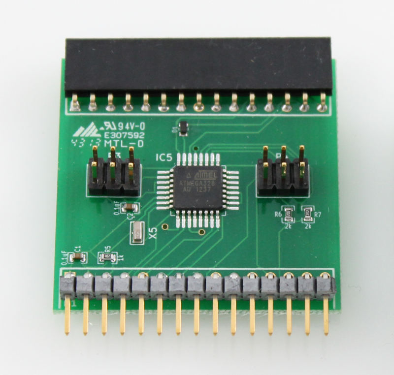
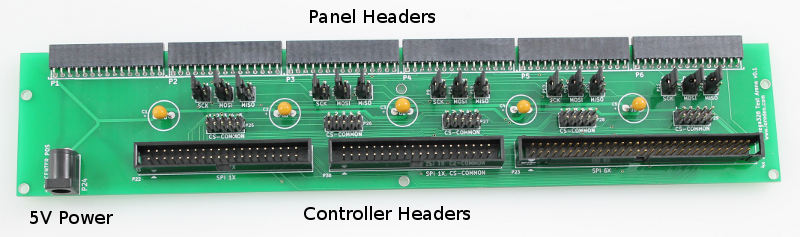
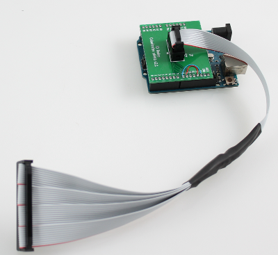

1. TOC
{:toc}

# System Components

A Generation 4 (G4) modular LED display consists of the following functional components:

- Panels
- Arena
- Controller

On this page we show different versions and additional equipment that can be used in conjunction with the G4 arena.

## G4 hardware set

Around 2018, a more complete setup contains the following components:

- Panels:
    - custom made driver boards with 16×16 LED on 40×40mm²
    - comm board v0.3
- Arena: 12/12 (pictured below) or 12/18 arena
- Controller: FPGA based PCIe card with G4 Host software
    - requires interconnect board and VHDI cable
    - breakout board for data recording
- 5V 10A power supply

## Prototype

The initial prototype from 2014 for the G4 system consisted of the following parts:

- Panels: 20 display panels with 2 PCB
    - each driver board with four 8×8 LED matrices measuring 20×20mm²
    - comm board with [ATmega328](https://www.microchip.com/wwwproducts/en/ATmega328)
- Arena: configurable planar arena which can accommodate 6 columns of panels
- Controller: [Arduino Uno](https://en.wikipedia.org/wiki/Arduino_Uno) based demo controller which shows a moving stripe pattern
- Cables: USB and 5V power supply (2.1mm center positive)

# Display Panels

A display panel consists of two sub-panel PCBs - the comm (communications) sub-panel and the driver (display) sub-panel. The comm panel physically connects the panel to its neighbors such as other panels or the arena board and handles the communication between the neighbors and the driver. The driver holds the LEDs and converts the commands received from the comm panel into LEDs turning on and off.

## Driver Sub-Panels

All G4 driver sub-panels contain 16×16 LED within 40×40mm² area. These LEDs are driven by four ATmega328 microcontroller units (MCU). Newer versions, which as detailed in the [Panel-G4-Hardware](https://github.com/floesche/Panel-G4-Hardware) repository, use one MCU per quadrant of 8×8 LEDs. Besides the limited number of IO lines on these MCUs, it also has historic reasons: Earlier versions used off-the-shelf 20×20mm² matrices with 8×8 LEDs. Each MCU of these panels received the pattern data for that panel and translated it into the on and off signals for the LEDs on the panel. The image below shows the front side of such an early version of the PCB. You can see the silver sockets for mounting the LED matrices and the order in which the LED are counted from 0 to 3. For further details consult the [panels_g4_hardware](https://github.com/floesche/panels_g4_hardware) repository (**note**: this is different from the more recent Panel-G4-Hardware repository mentioned above). The most recent version for the off-the-shelf matrices is inside the `atmega328/four_panel_20mm_matrix/ver4/driver_w_leds` path of the repository. Since at least 2017 we recommend using the newer custom made driver sub-panels as they allow better control over the color spectrum and the position of the LEDs.

## Comm Sub-Panels

The comm sub-panel contains a single atmega328 micro-controller which communicates with the display controller over SPI. The comm sub-panel's sole responsibility is to receive pattern data from the controller (via SPI) and send it on to the driver sub-panel (via I2C). Version v0.3 is the latest version of the panel, which is suitable for the custom driver panel. The latest version of the comm sub-panel is available at the [panels_g4_hardware](https://github.com/floesche/panels_g4_hardware/tree/master/atmega328/four_panel/20mm_matrix/ver3/driver) repository inside the `atmega328/four_panel/20mm_matrix/ver3/driver` directory.

# Arena

## Test Arena

The test arena is used to connect the panels with the controller and to supply
power to the panels. There are three headers which can be used to connect the
panels to the display controller.  

- P22 40-Pin (2x20) single SPI bus header. 
- P23 60_Pin (2x30) six SPI bus header.
- P30 40-Pin (2x20) six SPI bus w/ common chip select lines.

5V power is supplied to the panels via 2.1mm DC jack, polarity is center positive. 

There are 5 sets of jumpers which can be used to configure the arena.  (**TODO**: document jumper functions - for now refer to the arena schematic.)

[download Arena PCB Schematic](../assets/arena.pdf)

# Controller

## Computer based controller

In newer installations, the [National Instrument PCIe-7842R card](https://www.ni.com/en-us/support/model.pcie-7842.html) takes the role of the controller. This is a FPGA based reconfigurable high speed IO device which can deliver the required multiple SPI channels within the anticipated time constraints. In addition, a connected breakout box allows easy recording several analog data channels through the same device that is used to record other exerimental data.

## Prototype Controller

A demonstration controller, based on an Arduino Uno, is provided with the arena and panels. The demonstration controller connects to header P22 on the arena and will display a moving stripe pattern in 16-level gray scale mode.  The panels (up to four) should be connected to header P1 when using the demo controller. Note, the demo controller requires 5V power via the USB connector on the Arduino Uno in order to operate.

# Power Supply

A 5V 1A power supply is provided with the prototype panels, arena and controller. This supply is sufficient for operating roughly four panels - so enough for running the demo controller.  A higher current supply will likely be required in order to operate more than four panels. When selecting a power supply roughly 0.25A should be budgeted for each panel.  The connector is a 2.1mm DC jack and the supply should be center positive.

For an arena with 4×12=48 panel, a [5V 10A](https://www.adafruit.com/product/658) worked well in most applications.