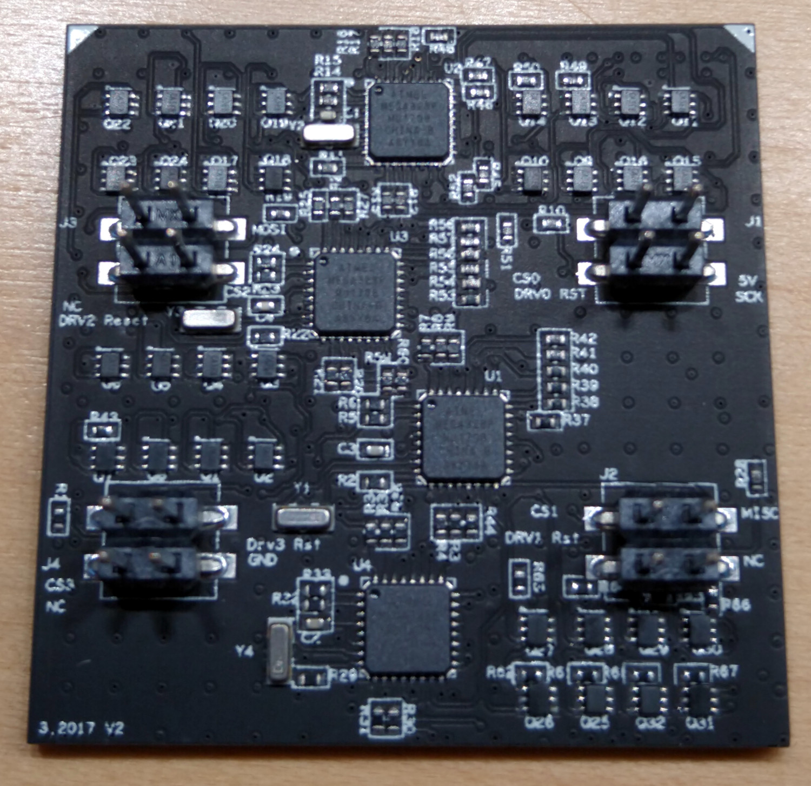
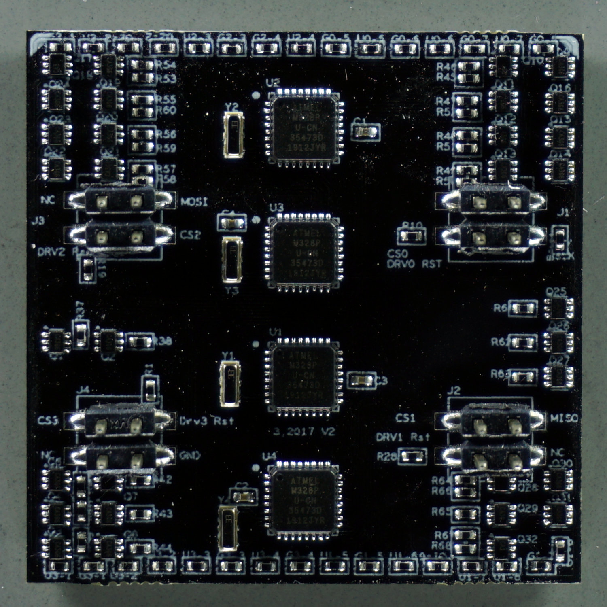
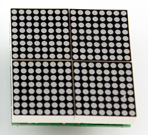

# Driver PCB

The driver board measures 40×40mm² and has four 4×4 male pins (>=v0.3) or two 2×6 female sockets (v0.2) on the bottom layer. The top of the driver board is either covered in LEDs (>=v1.0) or has connectors to off-the-shelf LED matrices. 

Internally the board is divided into four quadrants, each of which receives data through the connector via the I²C protocol. Each quadrant has a micro controller unit (MCU) that translates the incoming signals into turing the LEDs on and off.

## Panel Driver PCB v1.x
{:#driver-v1 .clear}

{:.ifr}

Driver boards >=v1.2 are 6 layer PCBs measuring 40×40mm². The production files are currently available in version [driver-v1.5](https://github.com/floesche/Panel-G4-Hardware/tree/master/production-v1/). All components are SMD with the smallest component measuring 0402 (imperial) or 1005 (metric). Therefore factory assembly is recommended.

Notice, that the second to the bottom layer is a ground layer. This design choice was intended to keep the electrical noise for ephys experiments down. So far we can't quantify if it worked, but we wanted to point out one of the not so obvious design choices.

### Function

The driver PCB receives signals on the four connectors (J1…J4), one for each quadrant. Each quadrant uses an ATMEGA328P-MU (U1…U4) to turn the LEDs (D1…256) on and off. The LEDs in each of the four quadrants are organized in an 8×8 matrix. The ATMEGAs use a row-scan algorithm, where at each point in time a single row is active. From this row any of the 8 LEDs can be turned on or off. Brightness is regulated through pulse width modulation. Each column uses its own resistor, therefore LEDs of different colors can be used for each column.

### Design

The files starting with version v1.2 are in its own dedicated repository [Panel-G4-Hardware](https://github.com/floesche/Panel-G4-Hardware/). The driver board was designed in-house at Janelia's [jET](https://www.janelia.org/support-team/janelia-experimental-technology) group. The [OrCAD](https://www.orcad.com/) EDA source file is provided for reference, although the latest production files might not always correspond with the design file version.

### Production

The Panel Driver PCBs are built from 6 layers. The BOTTOM layer contains all LEDs, followed by the GND layer, two logic layers, a power layer, and the TOP layer for the electronic components such as the MCUs and connectors.

# Historic designs

These designs are kept for historic reasons and to debug existing systems. If you have one of them, you probably know what to do and just need the files. If you are building a new system, don't use them.

## Panel Driver PCB 1.0 to 1.1
{:#driver-v0 .clear}

{:.ifr}

There are many similarities between the first iterations of driver-v1. You can spot if you have an earlier version by looking at the location of the MCUs: before version 1.2 they were in a straight line (see image on the right), after 1.2 they were oriented in a zig-zag (see [above](#driver-v1)).

## Panel Driver PCB v0.2 to 0.4
{:.clear}

{:.ifr}

Earlier versions of the driver were designed for off-the-shelf LED matrices. Historically this is what has been used in Generation 3 LED arenas and before as well. The latest version of the off-the-shelf LED matrices version, which is designed for four 20×20mm² components, is [driver-v0.4.2](https://github.com/floesche/panels_g4_hardware/tree/master/atmega328/four_panel/20mm_matrix/ver4/driver). You can find the driver designs of earlier versions in the same repository by navigating a few directories up.

{:.ifr}
The difference between these versions is minimal and can be documented if necessary. In general, they should be compatible between design iterations. Please [get in contact](../../../Contact.md) if you need further information.
{:.clear}

## Panel Driver PCB v0.1
{:#driver-v0p1}

The first driver with ATmega MCU used I²C for the communication between controller and arena. They are not compatible with later versions.

## other Panel Drivers

The [panel_g4_hardware](https://github.com/floesche/panels_g4_hardware) repository contains two other directory trees with designs using max6960 or stm32 MCUs. They were initial prototypes from around 2013 but should not exist in the wild. [Get in contact](../../../Contact.md) if you have one and need explanation about the nature of these historic files.