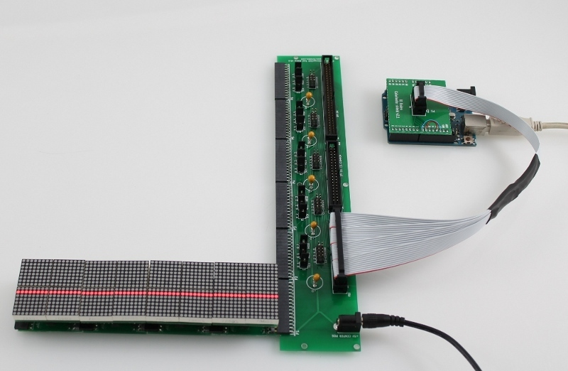

# Introduction

The fourth generation (G4) Panels system, currently in prototype stage, is a modular
display for designed for insect vision research. The G4 design is largely inspired
by the earlier Panels G3 design, however there are a few key differences: 

- smaller 20mm x 20mm LED matrices vs the larger 32mm x 32mm matrices used with the G3 Panels.
- SPI vs I2C for communications between the controller and panels for higher pattern transfer speeds. 
- synchronous controller driven dislay updates (patterns are only shown when the controller is sending pattern data).

